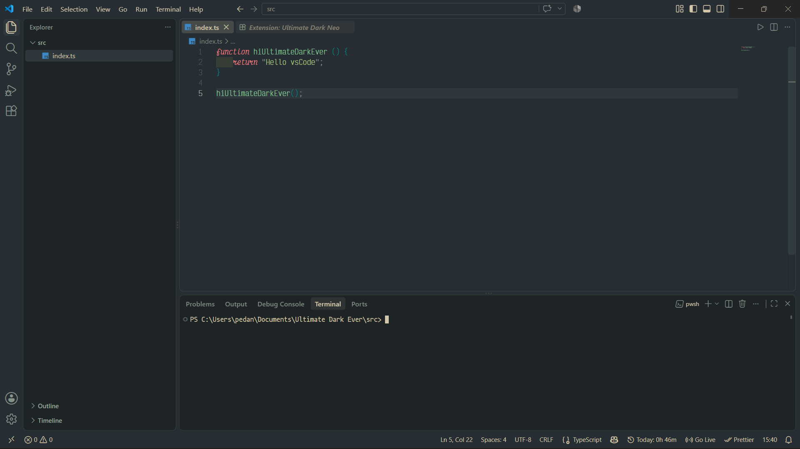

# Ultimate Dark Ever

A minimalist dark theme for Visual Studio Code, designed to offer maximum readability and comfort during long coding sessions.

## ✨ Features

- High-contrast dark color palette.
- Clear syntax highlighting for JavaScript, TypeScript, Python, and more.
- Soft colors for comments and secondary text.
- Compatible with the built-in terminal and debugging panels.

## 🚀 Installation

1. Open Visual Studio Code.
2. Go to the **Extensions** tab (`Ctrl+Shift+X`).
3. Search for **Ultimate Dark Ever**.
4. Click **Install**.
5. Enable the theme from `Preferences → Color Theme`.

## 🛠 Usage

- Quickly switch between themes with `Ctrl+K Ctrl+T`.
- Customize settings in `settings.json` if you want to adjust specific colors.

## 📷 Screenshots

## Font
The font use in this theme is [Victor Mono](https://rubjo.github.io/victor-mono/)

## 🤝 Contributions

Suggestions are welcome!
Open an issue or a pull request in the repository to propose improvements.

## 📄 License

This project is licensed under the MIT License.

